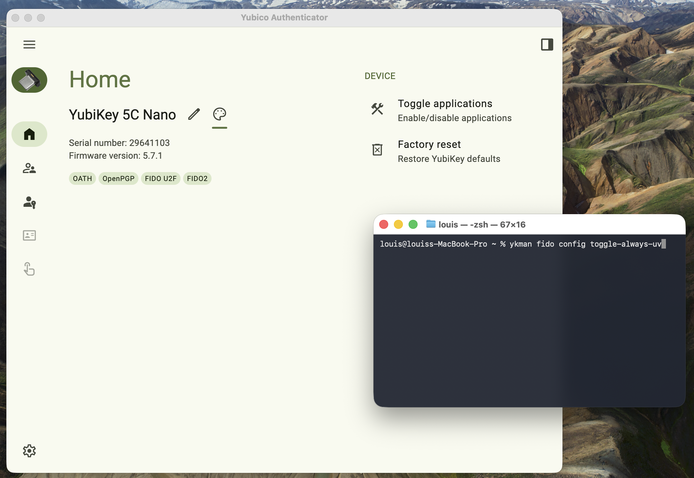

# YubiKeys-cheatsheet

This repo contains tips on how to properly use your YubiKeys.

## 📋 Summary

| Section | What it covers |
|---------|----------------|
| [YubiKey Interfaces / Applications](#yubikey-interfaces--applications) | What each YubiKey app does (FIDO2, OpenPGP, PIV, OATH, etc.) and when to use it |
| [1️⃣ YubiKey set up](#1️⃣-yubikey-set-up) | First-time setup: PINs, interfaces, registering on accounts |
| &nbsp;&nbsp;↳ [Example: Set up a YubiKey on Gmail](#example-set-up-a-yubikey-on-gmail-google-account) | Walkthrough of registering a key on a Google account |
| [2️⃣ Sign your commits with your YubiKey](#2️⃣-sign-your-commits-with-your-yubikey) | Generate an OpenPGP key on the card and sign Git commits, with touch |
| [3️⃣ Encrypting files with GPG + YubiKey](#3️⃣-encrypting-files-with-gpg--yubikey) | Encrypt a file so it can only be opened with the key present and touched |
| [4️⃣ KeePassXC setup with YubiKey (Challenge-Response)](#4️⃣-keepassxc-setup-with-yubikey-challenge-response) | Protect a KeePassXC password database so it can only be unlocked with the key present and touched |
| [🛠️ Troubleshooting: PIN prompt doesn't respond](#%EF%B8%8F-troubleshooting-pin-prompt-doesnt-respond) | Fixing the macOS pinentry / loopback freeze |

## YubiKey Interfaces / Applications

| Interface / App | What it is | Phishing-resistant | How you use it | Where / When to use it | Concrete examples |
|-----------------|------------|--------------------|---------------|------------------------|-------------------|
| **FIDO2** | Modern passwordless and 2FA authentication standard (WebAuthn + CTAP2) | **Yes** | Touch the YubiKey when prompted by the browser or OS | Best choice for web logins and OS authentication | Register passkeys on Google, GitHub, Microsoft, AWS; passwordless login or strong 2FA |
| **FIDO U2F** | Legacy FIDO standard (CTAP1), requires password first | **Yes** | Enter username/password, then touch the YubiKey | Older services that don't support full FIDO2 | GitHub legacy security key login; older VPNs, NAS devices |
| **OATH (TOTP / HOTP)** | One-time password generator stored on the YubiKey | **No** | Use **Yubico Authenticator** to read 6- or 8-digit codes | When a service only supports OTP-based 2FA | Generate TOTP for GitHub, Google, servers; fallback if passkeys/security keys aren't supported |
| **OpenPGP** | Smart card for PGP keys (signing, encryption, authentication) | **Yes** (for auth & signing) | Use `gpg`, email clients, SSH via GPG agent | Developer workflows, cryptographic identity | Sign Git commits; encrypt/decrypt emails; SSH login using GPG |
| **PIV (Smart Card)** | PKI smart card using X.509 certificates | **Yes** | Used automatically by OS, browsers, VPN clients | Enterprise, government, system authentication | Windows/macOS smart-card login; VPN authentication; client TLS certificates |
| **Yubico OTP** | Yubico proprietary one-time password | **No** | Touch key to type a long OTP string | Legacy systems and simple integrations | PAM authentication on servers; legacy VPNs; Yubico validation service |
| **HSM (HMAC / Secure Key Storage)** | Secure cryptographic operations inside the key | **Yes** (challenge-response) | Used by applications, not manually | Protect secrets and keys | LUKS disk unlock; challenge-response authentication |
| **NFC (Transport)** | Wireless communication channel | Depends on app | Tap key on phone or reader | Mobile and portable authentication | FIDO2 login on Android/iOS; OATH via NFC |

━━━━━━━━━━━━━━━━━━━━━━━━━━━━━━━━━━━━━━━━━━

## 1️⃣ YubiKey set up

### Download required tools

- **Yubico Authenticator** (To manage interfaces and set a PIN)  
  🔗 [Download here](https://www.yubico.com/products/yubico-authenticator/#h-download-yubico-authenticator)

- **YubiKey Manager** (for `ykman` command-line)  
  🔗 [Download last release](https://github.com/Yubico/Yubikey-manager/releases/)

### 📹 Tutorial Video

Watch a step-by-step video covering all of the steps:  
👉 [Watch the tutorial video](https://drive.google.com/file/d/1qxiXehIEOEhaRE4ae_PsudLVubsnKyEN/view?usp=sharing)

[](https://drive.google.com/file/d/1qxiXehIEOEhaRE4ae_PsudLVubsnKyEN/view?usp=sharing)

### Steps to repeat on all your YubiKeys

> 🍎 **macOS users:** Run all `ykman` commands below from the **built-in macOS Terminal app** (`/Applications/Utilities/Terminal.app`).
> Third-party terminals such as **iTerm2**, **Warp**, **Alacritty**, **Kitty**, **Hyper**, or VS Code's integrated terminal can interfere with USB/smart-card access and may cause `ykman` to hang, fail to detect the YubiKey, or silently swallow PIN prompts.
> If a `ykman` command misbehaves, switch to Terminal.app and try again before debugging anything else.

1. Verify your device is genuine:  
   🔗 [Yubico genuine check](https://www.yubico.com/genuine/)

2. Set a PIN on the YubiKey  
   - Use Yubico Authenticator → **Passkeys** tab  
   - PIN should be **4–6 digits**  
   - ⚠️ Recommended: use the **same PIN on all your YubiKeys** for simplicity

3. Enforce the PIN request when using FIDO (optional but recommended)  

```bash
ykman fido config toggle-always-uv
```
> 💡 Not supported on old Yubikeys, firmware prior to 5.7
>

### ✅ Your YubiKeys are ready

Now register them on **all of your accounts**.

You can check which apps and platforms support YubiKeys here:  
👉 https://safecheck.opsek.io/

#### Example: Set up a YubiKey on Gmail (Google Account)

1. Go to **Google Account Settings**
2. Open **Security**
3. Go to **Signing in to Google**
4. Enable **2-Step Verification (2FA)** if it's not already enabled
5. Navigate to **Passkeys & Security Keys**
6. Click **Add security key**  
   - *or* **Add a passkey** and **save it directly on the YubiKey**
7. Insert your YubiKey and follow the on-screen instructions
8. Once registered, rename your YubiKeys (Nano, 5C NFC 1, 5C NFC backup)

#### ⚠️ Important Notes

If you registered your YubiKey and **it did not ask you for a PIN**, you probably missed a step or did not complete the setup correctly. Make sure a **FIDO2 PIN is set** on the YubiKey and that you are adding a **security key / passkey**, not a less secure method.

**Do NOT store passkeys or security keys in 1Password or any password manager**  
Password managers should **only** be used to store passwords.  
Your YubiKey should be the **only place** where the passkey/security key is stored.

#### Best practices
- Register **at least two YubiKeys** (primary + backup)
- Keep your backup key in a safe, separate location
- Test sign-in with each key after setup

━━━━━━━━━━━━━━━━━━━━━━━━━━━━━━━━━━━━━━━━━━

## 2️⃣ Sign your commits with your YubiKey

### Prerequisites

Before you begin, make sure you have:

- Enabled the **OpenPGP interface** on your YubiKey (via Yubico Authenticator)  
  🔗 https://www.yubico.com/products/yubico-authenticator/

- Installed **GnuPG (GPG)**: on macOS: `brew install gnupg`  
  GitHub: https://github.com/gpg/gnupg

- Installed **YubiKey Manager** (for `ykman`): on macOS: `brew install ykman`  
  GitHub: https://github.com/Yubico/YubiKey-manager

> 🍎 **macOS users — important:** Run every `ykman` command in this section from the **built-in macOS Terminal app** (`/Applications/Utilities/Terminal.app`), not from iTerm2, Warp, Alacritty, Kitty, Hyper, or VS Code's integrated terminal.
> Third-party terminals frequently cause `ykman` to hang, fail to see the YubiKey, or silently fail PIN prompts because of how they sandbox USB / smart-card access. If a `ykman` command behaves strangely, the first thing to try is running it from Terminal.app.

### 🔐 YubiKey GPG (ed25519) → Signed Git Commit

#### 1) Configure GPG pinentry

GPG needs a **pinentry program** to securely prompt you for your PIN. Pick the path that matches your setup:

##### 🍎 macOS (recommended: native GUI popup)

Install `pinentry-mac` so GPG can show a native macOS popup when your PIN is needed:

```bash
brew install pinentry-mac

mkdir -p ~/.gnupg && chmod 700 ~/.gnupg

# Tell gpg-agent to use pinentry-mac
echo "pinentry-program $(brew --prefix)/bin/pinentry-mac" >> ~/.gnupg/gpg-agent.conf

# Reload the agent so the change takes effect
gpgconf --kill scdaemon
gpgconf --kill gpg-agent
```

> ⚠️ **Do NOT add `pinentry-mode loopback` to `gpg.conf` on macOS.** It forces GPG to prompt inside the terminal and **breaks PIN entry inside `gpg --card-edit`** on recent GnuPG versions (2.4+/2.5+): keypresses are silently swallowed and the prompt appears frozen. If you hit this, jump to [🛠️ Troubleshooting](#%EF%B8%8F-troubleshooting-pin-prompt-doesnt-respond).

##### 🐧 Linux (desktop)

Most distros install `pinentry-gtk` or `pinentry-qt` automatically with GPG. Nothing to do: just make sure `gpg-agent` is running.

##### 🖥️ Headless / SSH session (no GUI available)

**Only use this if you truly have no GUI** (e.g., signing over SSH on a remote box). It forces terminal-only PIN prompts:

```bash
mkdir -p ~/.gnupg && chmod 700 ~/.gnupg

cat > ~/.gnupg/gpg.conf <<'EOF'
use-agent
pinentry-mode loopback
EOF

grep -q '^allow-loopback-pinentry' ~/.gnupg/gpg-agent.conf 2>/dev/null || \
  echo 'allow-loopback-pinentry' >> ~/.gnupg/gpg-agent.conf

gpgconf --kill gpg-agent
```

#### 2) (Optional) Clean-slate the YubiKey OpenPGP applet

> ⚠️ Destroys any existing GPG keys on the key.
>
> 🍎 **macOS:** run these from **Terminal.app**, not iTerm2/Warp/etc. (see note at the top of this section).

```bash
ykman openpgp reset -f
ykman openpgp access change-pin
ykman openpgp access change-admin-pin

```

#### 3) Set strong key algorithms & generate **on the card**

```bash
gpg --card-edit
```

At the `gpg>` prompt, type exactly this (press ⏎ after each line):

```
admin
key-attr
```

> ### 🔑 About the "passphrase" prompt inside `gpg --card-edit`
>
> When you're in the `gpg --card-edit` interface, the **"passphrase"** being requested is actually the **PIN for your YubiKey's OpenPGP applet**: not your SSH passphrase or your GPG key passphrase.
>
> The OpenPGP applet uses **two separate PINs**:
>
> - **User PIN** (default: `123456`): used for day-to-day operations like signing, decrypting, and authenticating.
> - **Admin PIN** (default: `12345678`): used for administrative changes like modifying key attributes, generating keys on the card, or resetting the User PIN.
>
> Since `key-attr` is an **admin-level operation**, the prompt is asking for the **Admin PIN**. If you've never changed it, enter `12345678`. You'll also be prompted for the **User PIN** (`123456` by default) during key generation. You should change both PINs (see step 2 above, or use `passwd` inside `gpg --card-edit`) before loading any real keys onto the device.
>
> 💡 On macOS, the PIN prompt appears as a **`pinentry-mac` popup window**: not inside the terminal. If no popup appears and typing in the terminal does nothing, see [🛠️ Troubleshooting](#%EF%B8%8F-troubleshooting-pin-prompt-doesnt-respond).

Then, when prompted **for each slot**, choose:

- **Algorithm** → `2` (ECC)
- **Curve** → `1` (Curve25519)

You should end up with:

```
Signature key ....: ed25519
Encryption key....: cv25519
Authentication....: ed25519
```

Now generate the keys on the card:

```
generate
```

- **Make off-card backup?** → `n`
- Enter **Name** and **Email** (use your GitHub email)
- Choose an **expiry** (e.g., 1y)

- Enter **Admin PIN** and **User PIN** when prompted.  

  **Defaults for a new YubiKey OpenPGP applet:**
  - **User PIN:** `123456`
  - **Admin PIN:** `12345678`

> ⚠️ **Important:** These default PINs are **not secure**. You **must change them immediately** using:
>
> ```bash
> ykman openpgp access change-pin
> ykman openpgp access change-admin-pin
> ```
>
> 🍎 **macOS:** run these two commands from **Terminal.app**, not iTerm2 / Warp / Alacritty / VS Code's integrated terminal. Third-party terminals can cause `ykman` to hang or fail to see the YubiKey (see the note at the top of this section).
>
> Choose **strong, memorable PINs** for both User and Admin.


Exit:

```
quit
```

#### 4) Verify keys are on the card

```bash
gpg --card-status
```

Expect to see `ED25519 / CV25519` for the three slots.

#### 5) (Recommended) Require a YubiKey touch for every signature

By default, the YubiKey's OpenPGP **touch policy is `Off`** for all slots. That means once your User PIN has been entered and cached by `gpg-agent`, commits are signed **with no physical interaction at all**: any process running on your machine can sign on your behalf for as long as the YubiKey is plugged in.

Enabling the touch policy on the **signature** slot forces a physical tap on the YubiKey for **every** signing operation, so a commit can't be created unless you're physically present to touch the key.

```bash
ykman openpgp keys set-touch sig on
```

Confirm it's enabled:

```bash
ykman openpgp info
```

You should see `Signature key: On` under **Touch policies**.

> 🍎 **macOS:** run these from **Terminal.app**, not iTerm2 / Warp / Alacritty / Kitty / Hyper / VS Code's integrated terminal (see the note at the top of this section).
>
> 💡 **Older `ykman` / firmware:** on some builds the slot and policy must be uppercase (`ykman openpgp keys set-touch SIG ON`), and on `ykman` versions before 4.x the subcommand drops `keys` entirely (`ykman openpgp set-touch sig on`). You'll be prompted for the **Admin PIN**; to run it non-interactively add `-a <ADMIN_PIN> -f`.
>
> 💡 **Touch policy options:** `on` requires a touch for every signature. `cached` requires a touch but keeps it valid for ~15 seconds (gentler for rapid commits, slightly weaker). Avoid `fixed` / `cached-fixed` unless you're sure: they **can't be disabled without a full reset** of the OpenPGP applet.

> 💡 From now on, every `git commit -S` will make the YubiKey **blink and wait for a tap**, and the commit won't complete until you touch the key. You can also enable the same protection on the authentication (`aut`) and encryption (`enc`) slots: `ykman openpgp keys set-touch aut on` and `ykman openpgp keys set-touch enc on`.

#### 6) Export your **Primary Public Key** and add to GitHub (for commit verification)

You need to export the **Primary Public Key** (a.k.a. the **master / primary key**), **not** one of the subkeys. GitHub matches commit signatures against the primary key listed on your account.

##### Find your Primary Public Key ID

Run:

```bash
gpg --list-keys --keyid-format=long "you@example.com"
```

You'll see something like:

```
pub   ed25519/ABCDEF1234567890 2025-10-17 [SC]
      F1E2D3C4B5A697887766554433221100AABBCCDD
uid   [ultimate] John Doe <john@example.com>
sub   cv25519/1111222233334444 2025-10-17 [E]
sub   ed25519/5555666677778888 2025-10-17 [A]
```

The **Primary Public Key** is the one on the line starting with `pub` — in this example, `ABCDEF1234567890`. The lines starting with `sub` are subkeys (encryption `[E]` and authentication `[A]`); **don't use those**.

> 💡 You can also use the **full 40-character fingerprint** (the line directly under `pub`) instead of the short ID — it's unambiguous and recommended.

##### Export it

Replace `<PrimaryPublicKey>` with the ID (or fingerprint) you just found:

```bash
gpg --armor --export-options export-minimal --export <PrimaryPublicKey> > ~/YubiKey-gpg-public.asc
cat ~/YubiKey-gpg-public.asc
```

The `--export-options export-minimal` flag strips unnecessary signatures and produces a smaller, cleaner public key block — easier for GitHub to ingest.

➡️ copy everything (including the `-----BEGIN PGP PUBLIC KEY BLOCK-----` and `-----END PGP PUBLIC KEY BLOCK-----` lines) and paste at: https://github.com/settings/keys → **"New GPG key"**.

#### 7) Configure Git to sign commits with your YubiKey

1. Show the YubiKey key information:

```bash
gpg --card-status
```

2. Find the line starting with General key info:

```bash
pub  ed25519/AAAAAAAAAAAAAAAA 2025-10-17 John Doe <john@example.com>
```

3. Copy the key ID (the part after the /):
```bash
AAAAAAAAAAAAAAAA
```

4. Configure Git to use this key for signing:

```bash
git config --global user.signingkey AAAAAAAAAAAAAAAA
git config --global commit.gpgsign true
git config --global gpg.program gpg
git config --global user.email "john@example.com"
```

> 💡 **Heads-up if you have a second YubiKey:** When you set up your **2nd YubiKey** and want to use / test it for commit signing, you have to re-run:
>
> ```bash
> git config --global user.signingkey AAAAAAAAAAAAAAAA
> ```
>
> with the **key ID of the key in the 2nd YubiKey**. Otherwise Git will keep asking you to plug in the *first* YubiKey you set up, because that's the key ID still configured.
>
> **TL;DR:** you can only have one key configured for signing at any time — swap `user.signingkey` whenever you switch which YubiKey you're signing with.

5. Test signing a commit

```bash
git commit -S -m "test: signed commit"
```

6. Verify the signature:

```bash
git log --show-signature -1
```

You should see a **"Good signature"** message.

━━━━━━━━━━━━━━━━━━━━━━━━━━━━━━━━━━━━━━━━━━

## 3️⃣ Encrypting files with GPG + YubiKey

Encrypt a file so it can only be opened when your YubiKey is physically present and touched. This reuses the same OpenPGP key from section 2: encryption uses the **encryption (`cv25519`) subkey**, whereas signing used the signature subkey.

> 🍎 **macOS users:** run every `ykman` command below from the **built-in Terminal.app**, not iTerm2 / Warp / Alacritty / Kitty / Hyper / VS Code's integrated terminal (same reason as the rest of this guide).

> ✅ **Prerequisites:** you've completed section 2, so the **OpenPGP interface is enabled**, your **keys are generated on the card**, and **`pinentry-mac` is configured**. If `gpg --card-status` lists your three slots, you're ready.

#### 1) Identify the encryption key

```bash
ykman openpgp info        # the three slots + their touch policy
gpg --card-status         # shows the labeled "Encryption key" line
```

How to read it:

- The **`Encryption key....:`** line in `gpg --card-status` is the key that opens files.
- In the subkey list, the **`cv25519`** subkey is the encryption key (`cv25519` = ECDH / encryption). The `ed25519` subkeys are sign / auth.
- In `gpg --list-keys`, that same subkey carries the **`[E]`** usage flag.
- The recipient ID is the **last 16 hex chars** of that subkey's fingerprint.

#### 2) Require a touch to decrypt

By default the **encryption slot's touch policy is `Off`**: once the User PIN is cached by `gpg-agent`, any process can decrypt your files silently while the key is plugged in. Turn touch on so every decryption needs a physical tap:

```bash
ykman openpgp keys set-touch enc on
```

Enter the **Admin PIN** when prompted, confirm, then verify:

```bash
ykman openpgp info
```

The **Decryption key** must now read **Touch policy: On**.

> 💡 **Policy options:** `on` = a touch for every decrypt. `cached` = one touch valid for ~15 seconds. Avoid `fixed` / `cached-fixed` unless you're sure: they **can't be disabled without a full reset** of the OpenPGP applet (which wipes its keys).

#### 3) Encrypt a file

Encryption uses only the **public** key, so there is no PIN and no touch at this step. Replace `<ENC_KEYID>` with your encryption subkey's 16-char ID; the trailing `!` forces that exact subkey:

```bash
echo "this is my secret note - $(date)" > secret.txt

gpg --encrypt --recipient <ENC_KEYID>! secret.txt

ls -l secret.txt.gpg      # the encrypted blob
cat secret.txt.gpg        # binary garbage = good
```

#### 4) Decrypt the file (PIN + touch)

Remove the plaintext, then decrypt. A **`pinentry-mac` popup** asks for your User PIN, then the **YubiKey blinks → tap it**:

```bash
rm secret.txt
gpg --decrypt secret.txt.gpg
```

The note prints only after the touch.

#### 5) Prove the gate is real

Run decrypt again and **do not** touch the key:

```bash
gpg --decrypt secret.txt.gpg
```

It hangs, then fails (card operation cancelled) instead of opening. That is your proof that nothing decrypts silently: the file at rest is inert without the physical tap.

> 💡 **Encrypt a whole folder:** `tar cz mydir | gpg --encrypt --recipient <ENC_KEYID>! -o mydir.tgz.gpg`
>
> ⚠️ The private key never leaves the YubiKey, so **lose the key = lose the data.** Encrypt to a **second YubiKey** as well by adding another recipient (`--recipient <KEY1>! --recipient <KEY2>!`), or keep an offline backup key, so a lost token isn't permanent data loss.

> 💡 **`gpg: decryption failed: No secret key`** → run `gpg --card-status` once so GPG binds the card, then retry. If the PIN popup never appears, see [🛠️ Troubleshooting](#%EF%B8%8F-troubleshooting-pin-prompt-doesnt-respond).

━━━━━━━━━━━━━━━━━━━━━━━━━━━━━━━━━━━━━━━━━━

## 4️⃣ KeePassXC setup with YubiKey (Challenge-Response)
 
Create a KeePassXC database encrypted with **KDBX 4 + ChaCha20-256 + Argon2id** and protected by a **YubiKey in HMAC-SHA1 Challenge-Response mode** with **touch enforced**.
 
### 🧠 How it works (read this first)
 
KeePassXC unlocks the database using the YubiKey's **OTP** application in **HMAC-SHA1 Challenge-Response** mode. It does **not** use FIDO2/WebAuthn or OATH-HOTP for this.
 
Challenge-response is **deterministic**: KeePassXC stores a fixed challenge in the database header, the YubiKey computes `HMAC-SHA1(secret, challenge)` and returns the same response every time. That response is mixed into the key derivation, so the database can be decrypted reproducibly, but only by a key that holds the correct secret.
 
Two consequences drive the whole setup:
 
- The secret is written into the key and **cannot be read back out**. There is no way to "export" it later for backup.
- So the only way to have a spare key is to program **every** key with the **same secret** *during* setup. Two YubiKeys with the same secret are fully interchangeable. If you lose the only key holding the secret, the database is **unrecoverable**.
### Prerequisites
 
- **KeePassXC** 2.7 or newer
- **Two YubiKeys** (ideally three): one for daily use, one or two as offline backups
- **Yubico Authenticator** (recommended GUI). `ykman` or the legacy *YubiKey Personalization Tool* also work
- On **Linux**: the `yubikey-manager` package (provides `ykman`) and the `yubikey-personalization` library with its udev rules, so KeePassXC can detect the key
> 💡 **Verify the key is detected:** plug it in and open Yubico Authenticator, the device should appear in the app. If KeePassXC later can't see it, the cause is almost always the **OTP interface being disabled** (see Troubleshooting).
 
### Steps to repeat on all your YubiKeys
 
#### 1) Enable the OTP application
 
In Yubico Authenticator open the menu → **Toggle applications** (interfaces) and make sure **OTP** (Yubico OTP) is enabled. If it's off, challenge-response won't work at all.
 

 
#### 2) Program Slot 2 as Challenge-Response (HMAC-SHA1)
 
- Go to the **Slots** section and pick **Slot 2 (long-touch)**. Slot 1 usually ships with a factory Yubico OTP credential registered with YubiCloud, so using Slot 2 avoids overwriting it.
- Select **Challenge-Response (HMAC-SHA1)** on Slot 2.
- **Set the secret** (use the same secret on every key, see the note below).
- Enable **"Require touch"** so a physical touch is forced on every unlock. A remote attacker with access to your machine still can't unlock the database silently.

 
> ⚠️ Repeat this step on **every** backup key using the **exact same secret**.
 
#### 3) Destroy the temporary secret
 
Once **all** keys are programmed and verified, securely delete every temporary copy of the secret: the scratch note, clipboard, any file. You don't need it anymore, it now lives only inside the keys and can't be read back.
 
### Create the database in KeePassXC
 
Open KeePassXC → **Database → New Database**.
 
#### Step 1: Name and description
 
Set a name (e.g. `Passwords`) and an optional description, then click **Continue**.
 

 
#### Step 2: Encryption settings
 
Open **Advanced Settings** and configure:
 
| Parameter | Value | Why |
| --- | --- | --- |
| Database Format | **KDBX 4.0** | Required for the modern KDF and AEAD cipher below |
| Encryption Algorithm | **ChaCha20 (256-bit)** | Fast, constant-time AEAD cipher, no AES-NI dependency |
| Key Derivation Function | **Argon2id** | Memory-hard KDF, side-channel resistant |
 
Click **Continue**.
 

 
#### Step 3: Database credentials
 
- **Set a strong master password.** This stays as your first factor, the YubiKey is an *additional* factor, not a replacement.
- **Connect the primary YubiKey.**
- Click **Add additional protection → Add Challenge-Response**.
- In the hardware key dropdown, select your YubiKey and **Slot 2 - Challenge-Response** (the slot you programmed above).

 
> 💡 The key must be connected to appear in the dropdown. If you enabled touch, it may blink during this step, so touch it.
 
Click **Done / Create** and choose where to save the `.kdbx` file.
 
### ✅ Verify unlocking
 
1. Lock the database (**Database → Lock Database**) or close KeePassXC.
2. Reopen the `.kdbx` file.
3. Enter the master password **with the YubiKey connected**.
4. The key blinks → **touch it**.
5. The database opens.
Now repeat the whole test with the **second key** to confirm the backup actually works. Don't skip this, it's the only point where you can catch a key programmed with the wrong secret while recovery is still trivial.
 
### Backup and recovery
 
- **Two or more keys with the same secret** are your only recovery plan.
- Keep them in **different physical locations** (one on you, one in a safe).
- If you lose **every** key carrying that secret, the database **cannot be opened**. There is no KeePassXC-side recovery, the response is part of the key, and the secret was never exportable.
### 🛠️ Troubleshooting
 
**KeePassXC doesn't detect the YubiKey**
- Confirm the **OTP** application/interface is enabled (Step 1).
- On Linux, confirm `yubikey-personalization` and its udev rules are installed.
**The key blinks but nothing happens when unlocking**
- You enabled touch, so you must physically **touch** the key within the time window (about 15 s).
**I want to add challenge-response to an existing database**
- **Database → Database Security → Database Credentials → Add additional protection → Add Challenge-Response**, with the key connected.
### Flow summary
 
- Install KeePassXC and confirm the key is detected.
- Enable OTP, then program **Slot 2** as Challenge-Response (HMAC-SHA1) **with touch**.
- Reuse the **same secret** on a second key (backup), then destroy the temporary secret.
- Create the database: **KDBX 4.0 + ChaCha20-256 + Argon2id**.
- Add a master password **plus** challenge-response (Slot 2).
- Verify unlocking with **both** keys.

━━━━━━━━━━━━━━━━━━━━━━━━━━━━━━━━━━━━━━━━━━

## 🛠️ Troubleshooting: PIN prompt doesn't respond

**Symptom:** You run `gpg --card-edit`, type `admin` → `key-attr`, and when GPG asks for the PIN (or "passphrase"), **nothing happens when you type**: no characters, no dots, no error, no popup. Pressing Enter does nothing and the terminal appears frozen.

**Cause (macOS):** Your `~/.gnupg/gpg.conf` contains `pinentry-mode loopback`, which tells GPG to prompt inside the terminal instead of using a pinentry program. On recent GnuPG versions (2.4+ / 2.5+), **this terminal prompt does not work inside `gpg --card-edit`'s interactive REPL**: keypresses are swallowed and you're stuck.

**Fix:** Disable loopback mode and use `pinentry-mac` instead (the native macOS GUI popup).

### Step-by-step fix (macOS)

1. **Confirm which `gpg` you're running**: it should be Homebrew's, not GPG Suite's:
   ```bash
   which gpg
   gpg --version
   ```
   Expected: `/opt/homebrew/bin/gpg` (Apple Silicon) or `/usr/local/bin/gpg` (Intel), version ≥ 2.4. If you see `/usr/local/MacGPG2/...`, uninstall GPG Suite: it conflicts with Homebrew's `gpg` and is a frequent cause of pinentry weirdness.

2. **Install `pinentry-mac`:**
   ```bash
   brew install pinentry-mac
   which pinentry-mac   # should print /opt/homebrew/bin/pinentry-mac
   ```

3. **Wire it into `gpg-agent.conf`** (skip if already done):
   ```bash
   echo "pinentry-program $(brew --prefix)/bin/pinentry-mac" >> ~/.gnupg/gpg-agent.conf
   ```

4. **Check your current config for the loopback lines:**
   ```bash
   cat ~/.gnupg/gpg.conf
   cat ~/.gnupg/gpg-agent.conf
   ```
   If you see `pinentry-mode loopback` in `gpg.conf` or `allow-loopback-pinentry` in `gpg-agent.conf`, **that's the problem.**

5. **Disable loopback mode** (back up first):
   ```bash
   cp ~/.gnupg/gpg.conf ~/.gnupg/gpg.conf.bak
   sed -i '' 's/^pinentry-mode loopback/#pinentry-mode loopback/' ~/.gnupg/gpg.conf
   sed -i '' 's/^allow-loopback-pinentry/#allow-loopback-pinentry/' ~/.gnupg/gpg-agent.conf
   ```

6. **Fully restart the agent and smartcard daemon:**
   ```bash
   gpgconf --kill scdaemon
   gpgconf --kill gpg-agent
   gpgconf --launch gpg-agent
   ```

7. **Unplug and replug the YubiKey**, then retry:
   ```bash
   gpg --card-edit
   ```
   When GPG asks for the PIN, a **`pinentry-mac` GUI popup** will appear. Enter your PIN there: not in the terminal.

### Still stuck?

- **Test `pinentry-mac` directly** to confirm it runs at all:
  ```bash
  /opt/homebrew/bin/pinentry-mac
  ```
  Then type `GETPIN` + Enter. A popup should appear. Type `BYE` + Enter to exit. If no popup appears, macOS is blocking `pinentry-mac` itself: check **System Settings → Privacy & Security** for a blocked-app notification.

- **Check for leftover GPG Suite** hijacking the socket:
  ```bash
  ls /Library/LaunchAgents/ 2>/dev/null | grep -i gpg
  ls ~/Library/LaunchAgents/ 2>/dev/null | grep -i gpg
  ls /usr/local/MacGPG2/ 2>/dev/null
  ```
  If any of these exist, remove the LaunchAgents and uninstall GPG Suite completely, then repeat the fix.

- **Try from macOS Terminal.app** if you're using a third-party terminal (iTerm2, Warp, Alacritty, Kitty, Hyper, VS Code integrated terminal). These can interfere with USB / smart-card access and cause `ykman` and `gpg` to behave unpredictably with the YubiKey.

- **Duplicate `pinentry-program` lines** in `gpg-agent.conf` can also cause issues. Open the file and make sure there's only one.
